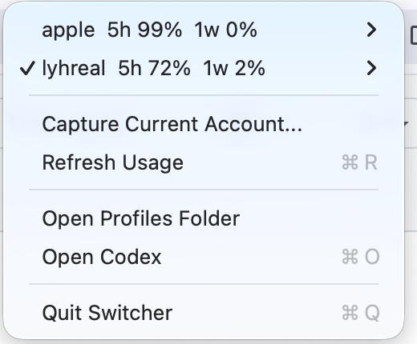

# Agent Status Indicator

**English** | [简体中文](#简体中文)

A local-first macOS menu bar app for monitoring Codex and Claude activity, opening recent sessions, and switching between saved Codex accounts.

The menu bar traffic lights make agent state visible at a glance:

- Red: blocked or stale
- Yellow: waiting for review or permission
- Green: working or recently completed
- Red and green: paused
- Dimmed lights: idle

## Release Status

The current `main` branch contains the unreleased Agent Status Indicator redesign with Auto, Codex, and Claude status modes.

The latest published binary is still the previous Codex-only release:

- [Codex Account Switcher v0.2.0](https://github.com/Purron/codex-account-switcher/releases/download/v0.2.0/CodexAccountSwitcher-v0.2.0-macOS.zip)
- [All GitHub releases](https://github.com/Purron/codex-account-switcher/releases)

> The downloadable build is not Apple-notarized. On first launch, macOS may require right-clicking the app and choosing **Open**, or allowing it in **Privacy & Security**.

## Screenshot



## Features

- Monitor local Codex and Claude sessions from the macOS menu bar
- Use Auto mode to combine sessions from both services
- Switch to Codex or Claude mode to inspect one service
- Show recent sessions with service icons, project names, times, and current state
- Open a recent session in its corresponding desktop app
- Switch between locally saved Codex profiles
- Capture the currently signed-in Codex account as a new profile
- Save the active Codex profile before switching away
- Restore Codex CLI and Codex Desktop authentication state
- Show the active Codex profile's 5-hour and weekly usage
- Refresh expired Codex access tokens when the usage endpoint returns an authorization error
- Keep profiles and cached usage data on the local machine

The bundled command-line script can also manage Claude profiles manually by setting `ACCOUNT_SERVICE=claude`. Claude account switching is not currently exposed in the menu bar profile UI.

## Requirements

- macOS 13 or later
- Codex Desktop, Claude Desktop, or both
- Codex CLI for Codex profile capture and switching
- Xcode Command Line Tools when building from source

## Build From Source

```bash
chmod +x build-app.sh agent-status-indicator.sh
./build-app.sh
open "build/Agent Status Indicator.app"
```

The app is written as a single native AppKit executable and does not require third-party build dependencies. The local build script does not sign or notarize the resulting app for distribution.

## Using the Status Panel

The status panel has three modes:

- **Auto** combines Codex and Claude activity and highlights the most relevant current state.
- **Codex** shows Codex sessions, saved Codex profiles, and available usage data.
- **Claude** shows recent Claude sessions and opens them in Claude Desktop.

Session status is derived from local Codex/Claude session metadata and compatible Agent Signal state when available. Old activity is marked stale or removed from the active list according to its state and age.

## Codex Profile Quick Start

Sign in to the first Codex account, then capture it:

```bash
./agent-status-indicator.sh capture personal
```

Sign in to another account and capture it:

```bash
./agent-status-indicator.sh capture work
```

Switch profiles:

```bash
./agent-status-indicator.sh switch personal
./agent-status-indicator.sh switch work
```

List profiles and show the active profile:

```bash
./agent-status-indicator.sh list
./agent-status-indicator.sh active
```

## CLI Reference

The default service is Codex:

```text
agent-status-indicator.sh capture <profile>
agent-status-indicator.sh switch <profile> [--no-open]
agent-status-indicator.sh delete <profile>
agent-status-indicator.sh list [--plain]
agent-status-indicator.sh active
agent-status-indicator.sh open-folder
```

Select a service with `ACCOUNT_SERVICE`:

```bash
ACCOUNT_SERVICE=codex ./agent-status-indicator.sh list
ACCOUNT_SERVICE=claude ./agent-status-indicator.sh list
```

Supported environment variables:

```text
AGENT_STATUS_INDICATOR_HOME  Profile storage directory
ACCOUNT_SERVICE              codex or claude; defaults to codex

CODEX_AUTH_FILE              Codex auth file; defaults to ~/.codex/auth.json
CODEX_APP_SUPPORT            Codex Desktop state directory
CODEX_APP_NAME               Codex macOS app name

CLAUDE_AUTH_FILE             Claude auth file; defaults to ~/.claude.json
CLAUDE_APP_SUPPORT           Claude Desktop state directory
CLAUDE_APP_NAME              Claude macOS app name
```

## Local Data

All profile data is stored under:

```text
~/Library/Application Support/AgentStatusIndicator
```

Codex profiles use:

```text
profiles/<name>/auth/auth.json
profiles/<name>/app-support/Codex
profiles/<name>/profile.env
```

Claude profiles created through the CLI use:

```text
services/claude/profiles/<name>/auth/claude.json
services/claude/profiles/<name>/app-support/<Claude state directory>
services/claude/profiles/<name>/profile.env
```

The app migrates data from the legacy `CodexAccountSwitcher` application-support directory when possible.

## Security Notes

Profile directories may contain authentication credentials, cookies, Local Storage, and desktop window state. Do not commit, upload, or share them.

Account capture and switching copy these files only between local directories. Codex usage requests authenticate directly with OpenAI's usage endpoint; tokens are not sent to third parties.

Codex or Claude Desktop must be stopped while its state is captured or restored because Electron/Chromium authentication state does not hot-reload safely.

## Project Structure

```text
.
├── AgentStatusIndicator.swift     # Native macOS menu bar application
├── agent-status-indicator.sh      # Codex/Claude profile management CLI
├── build-app.sh                   # Local application bundle builder
├── docs/                          # Documentation images
├── resources/                     # App icons and Info.plist
└── README.md
```

---

# 简体中文

[English](#agent-status-indicator) | **简体中文**

Agent Status Indicator 是一个本地优先的 macOS 菜单栏工具，用来监控 Codex 和 Claude 的运行状态、打开最近会话，以及切换本地保存的 Codex 账号。

菜单栏红绿灯用于快速表达 Agent 状态：

- 红灯：阻塞或状态过期
- 黄灯：等待查看或授权
- 绿灯：工作中或最近已完成
- 红绿灯同时亮：已暂停
- 暗色灯：空闲

## 版本状态

当前 `main` 分支是尚未发布的 Agent Status Indicator 重设计版本，已经包含 Auto、Codex 和 Claude 三种状态模式。

目前公开下载的仍是旧版 Codex-only 构建：

- [Codex Account Switcher v0.2.0](https://github.com/Purron/codex-account-switcher/releases/download/v0.2.0/CodexAccountSwitcher-v0.2.0-macOS.zip)
- [全部 GitHub Releases](https://github.com/Purron/codex-account-switcher/releases)

> 下载版尚未经过 Apple 公证。首次打开时，macOS 可能要求右键选择 **打开**，或在 **隐私与安全性** 中允许运行。

## 应用截图


## 功能特性

- 从 macOS 菜单栏监控本地 Codex 和 Claude 会话
- 使用 Auto 模式合并查看两个服务的会话状态
- 切换到 Codex 或 Claude 模式单独查看对应服务
- 展示最近会话的服务图标、项目名、时间和当前状态
- 在对应桌面 App 中打开最近会话
- 切换本地保存的 Codex profile
- 将当前 Codex 登录账号捕获为新的 profile
- 切换前自动保存当前 Codex profile
- 恢复 Codex CLI 与 Codex Desktop 的登录状态
- 展示当前 Codex profile 的 5 小时和 1 周用量
- 用量接口授权失败时尝试刷新 Codex access token
- 所有 profile 和用量缓存都保存在本机

附带的命令行脚本也可以通过 `ACCOUNT_SERVICE=claude` 手动管理 Claude profile。目前菜单栏的账号管理界面尚未开放 Claude profile 切换。

## 系统要求

- macOS 13 或更高版本
- Codex Desktop、Claude Desktop，或同时安装两者
- 使用 Codex profile 捕获和切换功能时需要 Codex CLI
- 从源码构建时需要 Xcode Command Line Tools

## 从源码构建

```bash
chmod +x build-app.sh agent-status-indicator.sh
./build-app.sh
open "build/Agent Status Indicator.app"
```

App 是单文件原生 AppKit 应用，不依赖第三方构建库。本地构建脚本不会对产物进行正式签名或 Apple 公证。

## 使用状态面板

状态面板包含三种模式：

- **Auto**：合并 Codex 和 Claude 活动，并突出显示当前最重要的状态。
- **Codex**：显示 Codex 会话、本地保存的 Codex profile 和可用的用量数据。
- **Claude**：显示最近的 Claude 会话，并可以在 Claude Desktop 中打开。

会话状态来自本地 Codex/Claude 会话元数据，以及存在时兼容的 Agent Signal 状态。旧活动会根据状态和时间被标记为过期，或从活动列表中移除。

## Codex Profile 快速开始

登录第一个 Codex 账号后捕获 profile：

```bash
./agent-status-indicator.sh capture personal
```

登录另一个账号后再次捕获：

```bash
./agent-status-indicator.sh capture work
```

切换 profile：

```bash
./agent-status-indicator.sh switch personal
./agent-status-indicator.sh switch work
```

列出 profile 并查看当前 profile：

```bash
./agent-status-indicator.sh list
./agent-status-indicator.sh active
```

## 脚本命令

脚本默认操作 Codex：

```text
agent-status-indicator.sh capture <profile>
agent-status-indicator.sh switch <profile> [--no-open]
agent-status-indicator.sh delete <profile>
agent-status-indicator.sh list [--plain]
agent-status-indicator.sh active
agent-status-indicator.sh open-folder
```

通过 `ACCOUNT_SERVICE` 选择服务：

```bash
ACCOUNT_SERVICE=codex ./agent-status-indicator.sh list
ACCOUNT_SERVICE=claude ./agent-status-indicator.sh list
```

支持的环境变量：

```text
AGENT_STATUS_INDICATOR_HOME  Profile 存储目录
ACCOUNT_SERVICE              codex 或 claude，默认为 codex

CODEX_AUTH_FILE              Codex auth 文件，默认 ~/.codex/auth.json
CODEX_APP_SUPPORT            Codex Desktop 状态目录
CODEX_APP_NAME               Codex macOS App 名称

CLAUDE_AUTH_FILE             Claude auth 文件，默认 ~/.claude.json
CLAUDE_APP_SUPPORT           Claude Desktop 状态目录
CLAUDE_APP_NAME              Claude macOS App 名称
```

## 本地数据

所有 profile 数据都保存在：

```text
~/Library/Application Support/AgentStatusIndicator
```

Codex profile 结构：

```text
profiles/<name>/auth/auth.json
profiles/<name>/app-support/Codex
profiles/<name>/profile.env
```

通过 CLI 创建的 Claude profile 结构：

```text
services/claude/profiles/<name>/auth/claude.json
services/claude/profiles/<name>/app-support/<Claude 状态目录>
services/claude/profiles/<name>/profile.env
```

App 会尽可能自动迁移旧 `CodexAccountSwitcher` 应用支持目录中的数据。

## 安全说明

profile 目录可能包含登录凭证、Cookie、Local Storage 和桌面窗口状态。请勿提交、上传或分享这些数据。

账号捕获和切换只会在本机目录之间复制相关文件。Codex 用量请求会直接向 OpenAI 的用量接口发起认证；token 不会发送给第三方。

捕获或恢复状态时需要停止 Codex 或 Claude Desktop，因为 Electron/Chromium 登录态无法安全地热更新。

## 项目结构

```text
.
├── AgentStatusIndicator.swift     # 原生 macOS 菜单栏 App
├── agent-status-indicator.sh      # Codex/Claude profile 管理脚本
├── build-app.sh                   # 本地 App Bundle 构建脚本
├── docs/                          # 文档图片
├── resources/                     # App 图标和 Info.plist
└── README.md
```
